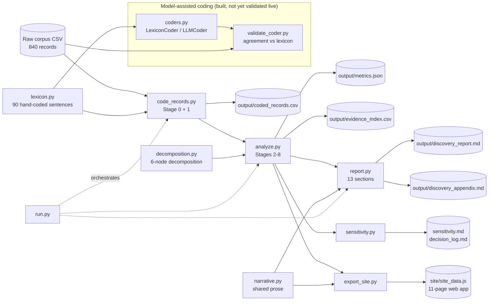
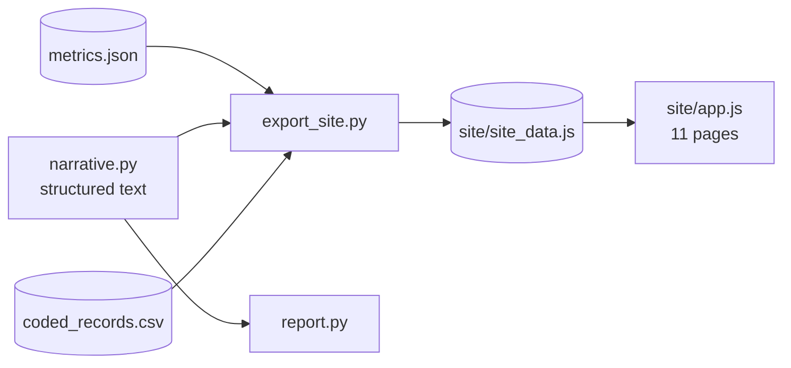

# Architecture — Product Discovery Engine

A small, deterministic pipeline that turns a raw conversation corpus about Google Photos into a traceable discovery report. It is a discovery system, not a solution generator: it stops at a provisional problem hypothesis and a research plan.

Status legend: **Built** exists and runs today (tests: `python -m pytest tests -q`) · **Planned** described in `implementationplan.md`, not yet written.

---

## 1. Principles that shape the design

| Principle | How the architecture enforces it |
|---|---|
| Traceability from every conclusion to raw evidence | Every coded field sits in `coded_records.csv` next to the verbatim sentence it came from; the report's numbers are computed, never typed |
| Evidence / interpretation / hypothesis / unknown stay separate | Analysis code emits counts only; interpretation lives in the report and narrative layers (the tag list is in the row below) |
| Counts are sample counts, not population stats | Counts are always "X of Y records"; production values are literal `TBD` |
| No assumption that AI, metadata or semantic search is the answer | No solution vocabulary in code or output; hypotheses are generated with competing explanations |
| Source and platform are not segmentation axes | Segments are predicates over memory, behaviour and outcome only; source is used solely in a structure test that shows it carries no signal |
| Fail loudly rather than mis-code | An unrecognised sentence raises an error, so coverage is 100% by construction |
| The six epistemic categories are never merged | The report tags `[RAW]`, `[OBS]` (observed count), `[INTERP]`, `[OPP-HYP]`, `[PROB-HYP]`, `[VALIDATED]` (none yet), plus `[ASSUME]` and `[UNKNOWN]`; a test rejects the old merged tags |
| Every conclusion traces to records | Every numbered section except the §11 framework table cites record IDs. Every named group (need, segment, opportunity, decomposition node, claim, hypothesis) has its full record list in `evidence_index.csv`; report sections show example IDs and the key |
| A model may read text but may not invent evidence | The model-assisted coder must quote the record verbatim for every populated field; ungrounded output is rejected, not repaired |

## 2. System overview



Run everything with `python -m engine.run` (add `--input` / `--output` for another corpus). Runtime dependencies: pandas, numpy, scipy, pydantic; `anthropic` only for the model-assisted coder.

## 3. Repository layout

```
google1/
├── google_photos_raw_dataset.csv   input (read-only)
├── engine/
│   ├── lexicon.py        sentence → codes (Built)
│   ├── code_records.py   Stage 0 relevance + Stage 1 extraction (Built)
│   ├── analyze.py        Stages 2-8 metrics (Built)
│   ├── report.py         Stage 15 report renderer (Built)
│   ├── decomposition.py  six-node decomposition, evidence rules, attribution rule (Built)
│   ├── coders.py         LexiconCoder + LLMCoder, grounding check (Built; LLM path not run live)
│   ├── validate_coder.py agreement harness for any coder (Built)
│   ├── config.py         input/output paths; --input and --output override them (Built)
│   ├── narrative.py      prose shared by the report and the web app (Built)
│   ├── sensitivity.py    alternative definitions and the decision log (Built)
│   ├── export_site.py    metrics + narrative + records → site_data.js (Built)
│   └── run.py            orchestration (Built)
├── site/                 static insights web app, 11 pages (Built)
│   ├── index.html        shell: banner, nav, record drawer
│   ├── app.js            page renderers; reads only site_data.js
│   ├── styles.css        light and dark themes
│   └── site_data.js      generated, never hand-edited
├── output/
│   ├── coded_records.csv (Built)
│   ├── metrics.json      (Built)
│   ├── sensitivity.md    target segment and ranking under alternative definitions (Built)
│   ├── decision_log.md   coding judgements that move a headline number (Built)
│   ├── discovery_report.md   the 13 sections (Built)
│   ├── discovery_appendix.md structure tests, object judgement calls, file map (Built)
│   └── evidence_index.csv    every named group → every record ID (Built)
├── tests/test_engine.py  invariants, snapshots, guardrails, coder harness (Built)
├── requirements.txt, .gitignore (Built)
├── problemstatement.md   provisional problem hypothesis
├── architecture.md       this file
└── implementationplan.md next steps
```

## 4. Components

### 4.1 Input contract
CSV with `record_id`, `source`, `source_type`, `date_posted`, `author_id`, `engagement`, `text`, `source_url`. Only `record_id`, `text` and (for duplicate checks) `author_id` matter analytically. `engagement`, `date_posted` and `source` are carried through but not used to derive findings. `source_url` is not used in the analysis.

### 4.2 `lexicon.py` — the coding model
A hand-written map from each of the 90 distinct sentences to its meaning. Sentences are grouped by the slot they occupy in a record:

| Slot | Content | Coded as |
|---|---|---|
| Opener | Framing (frustration, help request, vendor request) | `opener_code` — kept, never used as behaviour evidence |
| Object | What is being retrieved | 30 objects → 6 classes (trip/place, event, family/person, document/screenshot, medical, physical object) |
| Memory | What the user remembers and lacks | 12 sentences → `remembered`, `forgotten`, `express_barrier` |
| Behaviour / outcome | Exactly one per record | 18 sentences → `retrieval_state`, `outcome`, severity signals, journey stages |
| Closer (optional) | Recognition, library size, contrast, uncertainty | 8 sentences → flags and signals |

Off-topic single sentences (15 distinct) map to a topic; only deleted-photo restore is treated as "possibly relevant".

### 4.3 `code_records.py` — Stage 0 and Stage 1
- Splits text into sentences and validates the slot order (4–5 sentences for retrieval records).
- Classifies each record: retrieval-related, possibly relevant, not retrieval-related. The report also lists insufficient-evidence and ambiguous counts, but both are fixed at 0 in `analyze.py`: no coding rule emits them, because every non-relevant record in this corpus is unambiguous. A different corpus would need such rules.
- Extracts spec fields A–F: retrieval object, neutral scenario, remembered, forgotten, behaviour, outcome. Outcome uses the spec vocabulary (found quickly, found with effort, found after reformulation, found after browsing, similar but uncertain, failed, abandoned, external workaround, unknown); an unstated outcome is `unknown` and is never inferred.
- Flags exact duplicates, near-duplicates (same object, memory, behaviour and closer; different opener) and low-information records.
- Assigns `journey_stages` (Remember → Express → Match → Recognize → Recover) from the sentences that evidence each stage.

`coded_records.csv` columns: identity fields, `relevance`, verbatim `*_text` columns, codes, `remembered`, `forgotten`, `forgotten_family`, `express_barrier`, `scenario`, `retrieval_state`, `outcome`, `outcome_stated`, `journey_stages`, `severity_signals`, `n_severity_signals`, duplicate and signature columns.

### 4.4 `analyze.py` — Stages 2 to 8
Pure functions over the coded relevant records; no prose.

| Output | How it is defined |
|---|---|
| Needs (N1–N9) | Non-exclusive boolean predicates over memory and behaviour codes |
| Segments (SEG-1…4, SEG-T) | `retrieval_state` is mutually exclusive by construction (one behaviour sentence per record), so SEG-1…4 sum to the relevant count; SEG-T is the union of SEG-2 and SEG-3 |
| Opportunities (O1–O8) | Non-exclusive predicates; frequency, outcome profile and example record IDs per opportunity |
| Vocabulary-complete counts | Every count dictionary is filled over its full vocabulary, so a corpus missing a code yields a zero rather than a missing key |
| Journey | Records touching each stage, records with explicit breakdown evidence, most common stage paths |
| Target segment | Size, outcome profile, evidence counts, robustness to duplicate removal |
| Impact sizing | Observed counts only; production terms are `TBD` |
| Structure tests | Chi-square and Cramér's V for object × memory, memory × behaviour, object × state, source × state and others |
| Decomposition | Per node (D1–D6): records with explicit breakdown, indirect signs, effort, intact capability, attempt only, and no evidence (§4.7) |
| Behaviour and outcome distributions | Seven behaviour groups over the 18 stated behaviours; every outcome category from the brief, zeros included |
| Stage questions | The five journey-stage questions answered with counts |
| Need and segment profiles | Retrieval context, journey stages, remembered and forgotten mix, outcome mix per need and segment |
| Evidence index | Every named group and claim → all record IDs |

Every profile reports `n`, `of`, percent, outcome counts (including `unknown`) and severity-signal counts, so no figure appears without its denominator.

### 4.5 `report.py` — Stage 15
Renders the 13 required sections plus two appendices from `compute()`. It holds the interpretation, hypotheses, prioritisation rationale, research plan, interview guide, usability tasks, synthesis framework and provisional problem definition. Numbers are interpolated from metrics; frequency labels (High ≥ 30%, Medium 15–29%, Low < 15%) are asserted against the computed values so text and data cannot drift apart.

### 4.6 `run.py`
Builds the coded table once, writes `coded_records.csv`, `evidence_index.csv` and `metrics.json`, then renders `discovery_report.md` and `discovery_appendix.md`.

### 4.7 `decomposition.py` — the decomposition of successful retrieval
Successful retrieval of a vaguely remembered photo is decomposed into six nodes. A retrieval fails at the first node that does not hold. Four nodes are the case brief's questions; two are boundary conditions.

| Node | Case question | User behaviour | Product outcome |
|---|---|---|---|
| D1 Remember | What do people remember and forget? | Holds partial context | Precondition of the case |
| D2 Express | Is the user context-to-query translation what they remember? | Turns memory into a query or action | The input carries the clues the user holds |
| D3 Understand & match | Does Google Photos fail to understand the clues? | Submits clues, inspects results | The intended photo is among the candidates |
| D4 Evaluate | Are relevant results hard to evaluate? | Scans and decides | The user confirms the right photo |
| D5 Refine | Does the user struggle to refine? | Reformulates, switches, browses, stops | A failed first attempt still ends in success or an informed stop |
| D6 Available | Is the photo in the searchable library? | Asks someone, switches app, gives up | Retrieval is possible |

Each record is scored per node on five polarities (breakdown, indirect, effort, intact, attempt). Two results matter for the design:
- **D3 has no explicit breakdown evidence** (0 of 800 records say the product misread the clues). The engine reports this as an unanswerable question, not as a negative answer.
- **Attribution cannot be done from statements**, so the module carries a first-failing-node rule (D6 → D1 → D2 → D3 → D4 → D5) for classifying every unsuccessful task in the primary research, and a candidate product measure per node marked TBD.

### 4.8 `coders.py` and `validate_coder.py` — the model-assisted layer
Both coders return one `Coding` schema (relevance, object class, remembered, forgotten, express barrier, retrieval state, outcome, severity signals, verbatim quotes).

| Coder | Behaviour |
|---|---|
| `LexiconCoder` | Exact and deterministic; returns nothing for text it does not recognise |
| `LLMCoder` | Uses `client.messages.parse` with the schema; the record is passed as data inside `<record>` tags; refusals, unparseable output and API failures return no coding instead of a guess; a malformed request or bad credentials raises. Model comes from `DISCOVERY_CODER_MODEL`, default `claude-opus-5` |

`grounded()` rejects any coding whose quotes are not verbatim spans of the record, or whose populated fields have no supporting quote.

`validate_coder.py` scores a coder against the lexicon: accuracy and Cohen's kappa for single-label fields, micro-F1 for multi-label fields, grounding rate, and uncoded count. `--perturb` rewrites the text (lower-case, no punctuation) so template matching fails. On this corpus the lexicon reads 200 of 200 original records and 0 of 200 reworded ones, which is the reason a model-assisted coder exists.

**Status:** the harness is built and tested with fake clients. **The `LLMCoder` has not been run against the live API** because no credentials were available. Nothing about its accuracy is known yet, and the lexicon remains the coder of record.

## 4A. Presentation layer — insights web app (Built)

The web app gives a Product Manager one page per stage of the discovery chain, so they can explore evidence instead of reading a long document. It is static and offline: serve `site/` on any port, or open `site/index.html` from disk. Guardrail tests enforce the rules below.



### Pages

| Page | Discovery stage | Shows | Data source |
|---|---|---|---|
| **Overview & data quality** | 0 | Record classification, duplicates, low-information records, data-quality limitations, structure tests | `stage0`, `independence`, `incoherent_pairs` |
| **Insights** | 1, 3 | Needs landscape, what users remember versus lack, stated outcomes, severity signals, retrieval objects | `needs`, `stage1` |
| **Journey** | 2 | Remember → Express → Match → Recognize → Recover: records touching each stage, breakdown evidence, common paths | `journey` |
| **Segments** | 4 | SEG-1…4 and the target segment with definitions, counts, outcomes, overlap with expression-barrier statements | `segments` |
| **Opportunities** | 5–6 | O1–O8 cards and the prioritisation table with rationale and the selected opportunity | `opps`, narrative |
| **Target & impact** | 7–8 | Target segment hypothesis, assumptions, impact-sizing chain with observed / assumed / TBD columns | `target`, `impact` |
| **Opportunity hypotheses** | 9 | H1–H7: observation, interpretation, hypothesis, competing explanation, falsification test, verdict field (untested until research is done) | narrative |
| **Research plan** | 10–12 | Interview guide, usability tasks, survey plan, recruitment, sample-size rationale | narrative |
| **Synthesis** | 13 | Participant-level ledger and pattern tracker, empty until fieldwork | research ledger |
| **Problem statement** | 14 | Provisional statement, evidence per element, validation-gate checklist | narrative, `metrics.json` |
| **Evidence matrix & record explorer** | 13, 15 | The mandatory claim / evidence / interpretation / hypothesis / unknown table; search and filter every coded record with its verbatim text | `coded_records.csv` |

### Rules for the web app

1. **No hard-coded numbers.** Every count in the UI comes from `site_data.js`. (The earlier engine's UI kept ranking numbers in JavaScript, and they went stale when the dataset changed.)
2. **Every number drills down.** Clicking a count opens the records behind it, with the verbatim text and codes, so traceability survives in the UI.
3. **Every statement carries its label chip:** observed data, interpretation, hypothesis, assumption, unknown.
4. **Denominators are always shown** ("X of 800"). No bare percentages, and no population wording.
5. **No solution content.** The UI has no feature ideas, and the Opportunity hypotheses page shows verdicts only after research supplies them.
6. **Static and offline.** Data is embedded in a script file, so `site/index.html` opens from disk with no server and no network.

### How the no-stale-numbers rule is kept
`narrative.py` holds the prose; anything depending on a count is a function taking the computed metrics, so a number is never pasted into text. `export_site.py` writes `site/site_data.js` from the same metrics the report uses. One test fails the build if a headline number appears as a literal in `app.js`; another compares the site's evidence index against the computed counts.

Frequency labels in the prioritisation table are computed from the data (High at least 30%, Medium 15–29%, Low below 15%) rather than hand-written, so the engine runs on a different corpus without editing prose. `sensitivity.md` reports which labels are threshold-dependent.

## 5. Key design decisions

| Decision | Reason | Trade-off |
|---|---|---|
| **Hand-coded lexicon instead of a language model** | The corpus is a closed set of 90 sentences; a lexicon is exact, deterministic, auditable and free of model drift | Does not generalise. Real, free-text data needs a different coder that emits the same schema (see §7) |
| **One mutually exclusive state plus overlapping predicates** | Gives segments that sum to the total, while needs and opportunities can overlap honestly | The state is a single snapshot per record, so states can be pooled (SEG-T) but not sequenced |
| **Outcome never inferred** | Rule against fabricating findings; 590 of 800 records state no outcome | Success and failure rates are unobservable; the report says so |
| **Structure tests in the pipeline** | Shows which cross-tabs are meaningful; here all are chance-level | Results are indicative only (sparse cells) |
| **Report generator in code, not hand-written markdown** | Numbers regenerate when the lexicon or predicates change | Narrative changes need a code edit |

## 6. Known limitations `[OBS]`

- Text is template-composed, so frequencies describe how the file was generated. Object, memory, behaviour and source are statistically independent, and 66 of 241 document/object records pair the item with people/place/album memory, so object-specific conclusions are unsafe.
- Outcome and state come from the same sentence, so outcome-by-segment tables restate the definition.
- The corpus is complaint-selected: no quick, uneventful retrievals exist, so no baseline or success rate can be computed.
- Automated tests cover invariants, headline snapshots, report guardrails and the coder harness (26 tests). There is still no second-coder review of the lexicon, and the live-model coder is unvalidated.
- Agreement with the lexicon is agreement with a reference the same author wrote, so it shows consistency, not truth about real users.

## 7. Extension points (Planned)

| Extension | Purpose |
|---|---|
| Run and accept the `LLMCoder` on real text | Built; needs a live validation run (`implementationplan.md` Phase 1C) before it replaces or supplements the lexicon |
| `research_ledger` — participant-level observations from interviews and tasks | Apply the synthesis rules (pattern needs ≥ 3 participants, counts as "n of N participants") |
| Sensitivity module | Re-run segments and prioritisation under alternative definitions and with duplicates removed |
| Production-data adapter | Fill the `TBD` terms in impact sizing once Google data is available, kept separate from sample findings |
| Editable hypothesis verdicts and ledger entry in the web app | Only needed once fieldwork starts; verdicts currently render as `untested` |
| CI | Tests exist (`python -m pytest tests -q`); wiring them to run automatically is not done |

## 8. Report structure decision

The brief asks for "exactly this structure": thirteen numbered sections. The report has exactly `## 1.` to `## 13.`, in the brief's order. Before §1 there is only a title, the label key and one traceability line. The discovery chain, structure tests, object judgement calls and file map live in `output/discovery_appendix.md`. Extra tables that serve a brief requirement (need detail, behaviour and outcome distributions, decomposition, per-segment signals) sit inside the section they belong to. A test enforces the section list and the short preface.

## 9. Non-goals

The engine does not choose or rank solutions, does not estimate production metrics, does not use sentiment or engagement as discovery signals, and does not treat observed sample counts as population statistics.
