# Architecture: AI-Powered Discovery Engine (Phase by Phase)

> This document describes how the engine turns user conversations into traceable discovery evidence. It is organised by build phase, so each section matches a phase in [implementationplan.md](implementationplan.md).
> Related: [problemstatement.md](problemstatement.md) (why) · [README.md](README.md) (how to run)

---

## How to Read This Document

Each phase adds one architectural layer on top of the phases before it. Every phase section follows the same structure:

| Heading | Answers |
|---|---|
| **Goal** | What this layer is responsible for |
| **Modules** | Which files implement it |
| **Design** | How it works internally (diagrams, tables, rules) |
| **Interfaces** | What it consumes and produces for other phases |
| **Key decisions** | Why it is built this way |
| **Verification** | How we know it works (tests, acceptance checks) |

### Phase map

| Phase | Layer | Modules | Produces | Used by |
|---|---|---|---|---|
| [0](#phase-0-foundation) | Foundation | `taxonomy.py`, `models.py`, `store.py`, `config.py` | Vocabularies, data contracts, SQLite schema, settings | All phases |
| [1](#phase-1-ingestion) | Ingestion | `ingest.py` | `records`, `chunks` (RAW) | 2, 7, 11 |
| [2](#phase-2-analysis-layer) | Analysis | `analyze/llm.py`, `analyze/heuristic.py`, `analyze/runner.py` | `ChunkAnalysis` payloads | 3 |
| [3](#phase-3-evidence-validation) | Validation | `validate.py`, overrides in `store.py` | `analyses`, `signals` with evidence IDs; `overrides` | 4–8 |
| [4](#phase-4-quantitative-and-qualitative-synthesis) | Quant | `quant.py` | `Corpus`, rates, distributions, cross-tabs, journey | 5, 6, 7, 8 |
| [5](#phase-5-segments-opportunities-contradictions) | Synthesis | `synthesis.py`, `evidence.py` | Segments, opportunities, contradictions, strength | 6, 8 |
| [6](#phase-6-hypotheses-and-research-handoff) | Handoff | `hypotheses.py`, `report.py` | Hypotheses, JTBD, leading opportunity, bundle, reports | 8 |
| [7](#phase-7-exploration-interface) | Exploration | `search.py`, `ask.py` | Diversified evidence search, question answering | 8 |
| [8](#phase-8-api-and-dashboard) | Access | `server.py`, `web/index.html`, `web/styles.css`, `web/app.js` | REST API, discovery workspace | PM |
| [9](#phase-9-synthetic-generator-and-evaluation) | Test data | `synthetic/`, `evaluate.py` | Legacy generator, ground truth, accuracy scores | 10 |
| [10](#phase-10-tests-and-docs) | Quality | `tests/`, docs | Test suite, documentation | — |
| [11](#phase-11-raw-dataset-google_photos_discovery_annotated) | Data | `google_photos_discovery_annotated.xlsx` → `.csv` | The single raw dataset; annotation cross-check | 1 → 8, 12 |
| [12](#phase-12-discovery-workspace-uiux) | Experience | `web/index.html`, `web/styles.css`, `web/app.js`, `/api/meta`, `/api/review` | Discovery workspace | PM |

### Layer stack

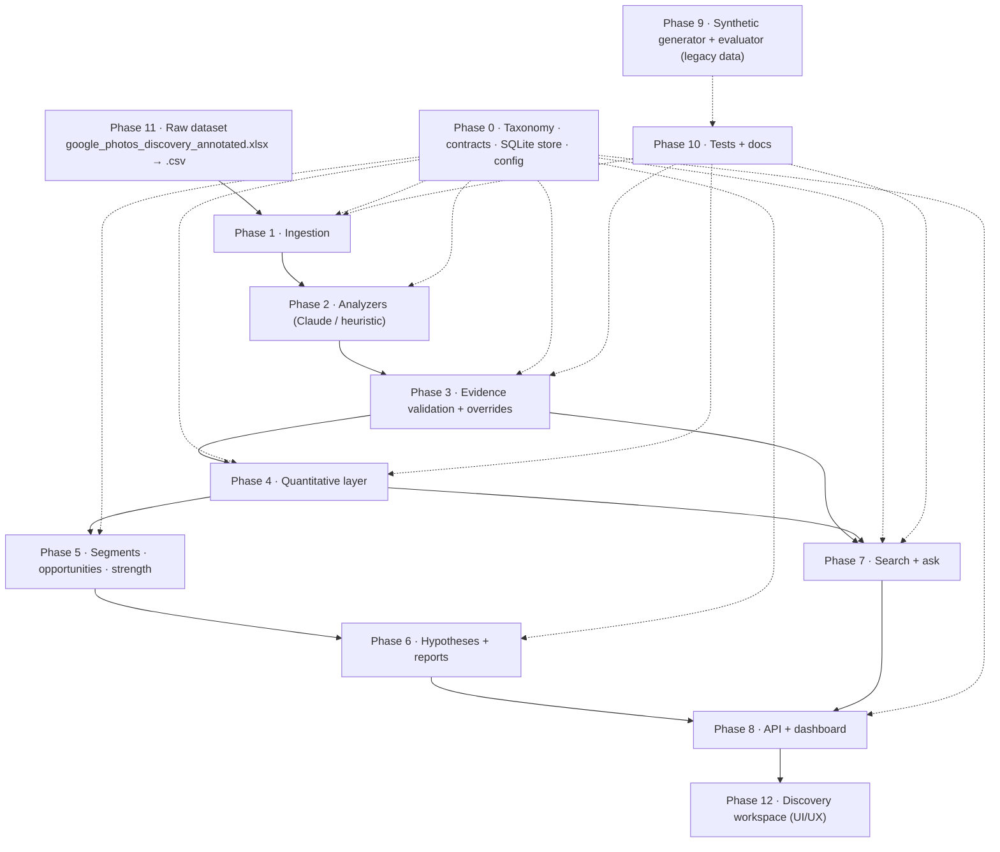

---

## Design Principles (apply to every phase)

| Principle | Where it is enforced |
|---|---|
| Raw evidence ≠ AI interpretation | Phase 0 schema: `records` and `chunks` are never modified by analysis; analyses are versioned. |
| No fabrication | Phase 3: every claim carries a verbatim quote; quotes that can't be found are excluded from all counts. |
| Honest numbers | Phase 4: every rate comes from one helper that returns numerator, denominator, definition, scope and a directional flag. The LLM never produces numbers. |
| Auditability | Phases 3–8: evidence IDs link each signal to its analysis and record, so any opportunity drills down to source text. |
| Human in the loop | Phases 0, 3, 8: PM corrections live in `overrides` and are applied when data is read. Original AI output is kept. |
| No hidden scoring | Phases 5–6: evidence strength follows explicit rules; comparisons are dimension by dimension; the leading-opportunity rule is printed with its result. |
| Solution neutrality | Phases 0, 6: opportunity areas are problem spaces; unknown labels become `proposed:*`; interview questions pass a leading-question filter. |
| Accurate provenance | Phases 1, 4–8, 11, 12: the ingest flag records each dataset's provenance and drives the workspace pill, report caveats and strength caveats. |
| Works offline and with Claude | Phase 2: both analyzers write one schema, so everything downstream doesn't care which analyzer ran. |

---

## End-State System Overview

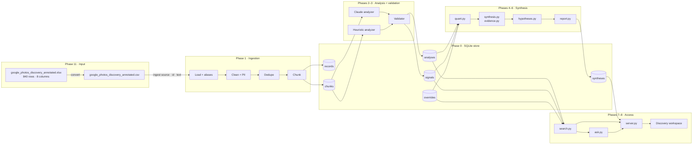

**Request paths**
- **Batch:** `ingest → analyze → synthesize` writes a bundle to `syntheses` and Markdown files to `reports/`.
- **Interactive:** the dashboard reads the latest bundle; Explore and Ask query live analyses through the evidence index.
- **Correction loop:** a PM override is stored, then Rebuild recomputes the bundle with the override applied.

---

## Phase 0: Foundation

### Goal
Define the vocabularies, data contracts, storage and settings that every later phase depends on. The core rule is enforced here: raw evidence and AI interpretation are stored separately.

### Modules

| File | Responsibility |
|---|---|
| `taxonomy.py` | Controlled vocabularies: journey stages, retrieval scenarios, memory signals, forgotten information, behaviours, workarounds, failure taxonomy A–G, success status, query orientation, epistemic levels, evidence-strength levels, seed opportunity areas |
| `models.py` | Pydantic contracts: `RawRecord`, `Signal`, `QueryAttempt`, `JourneyStep`, `ChunkAnalysis`, `RelevanceResult` |
| `store.py` | SQLite schema, write helpers, and read views that apply overrides |
| `config.py` | Settings that environment variables can override |

### Design

**Data model**

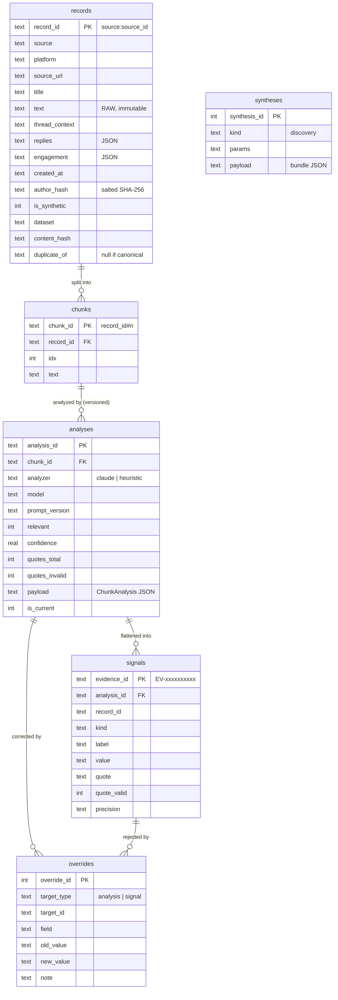

| Table | Layer | Written by | Mutable? |
|---|---|---|---|
| `records`, `chunks` | RAW evidence | Phase 1 | Never |
| `analyses` | AI interpretation | Phases 2–3 | Append only; old versions set to `is_current = 0` |
| `signals` | AI interpretation, flattened | Phase 3 | Append only |
| `overrides` | PM judgement | Phases 3, 8 | Append only |
| `syntheses` | Derived bundles | Phase 6 | Append only; latest is read |

**The `ChunkAnalysis` contract** (the schema both analyzers must produce):

| Group | Fields |
|---|---|
| Relevance | `relevant`, `relevance_reason`, `perspective`, `describes_retrieval_attempt` |
| Scenario | `retrieval_scenario`, `retrieval_object`, `success_status` |
| Memory | `remembered_information[]`, `forgotten_information[]`, `forgotten_info_blocks_retrieval` |
| Search | `queries[]` (`QueryAttempt`), `search_strategies[]`, `query_refinements[]`, `attempt_count` |
| Failure | `failure_stage`, `failure_reason`, `failure_quote`, `journey[]` (`JourneyStep`) |
| Behaviour | `user_behaviors[]`, `workarounds[]`, `expectations[]` |
| Segment / JTBD | `user_goal`, `segment_signals[]`, `jtbd_signal` |
| Synthesis hooks | `opportunity_areas[]`, `counter_evidence[]`, `interpretation`, `supplementary_sentiment`, `confidence` |

Every list item is a `Signal`: `label`, `value`, `quote` (verbatim) and `precision` (exact / approximate / not_applicable).

**Read views with overrides**
- `Store.current_analyses(include_synthetic)`: current, non-duplicate analyses joined to record metadata. Analysis overrides replace payload fields at read time.
- `Store.current_signals(include_synthetic, valid_only)`: valid-quote signals from relevant analyses (after overrides), minus signals a PM rejected.

**Configuration**

| Variable | Default | Used by |
|---|---|---|
| `DE_DB_PATH` | `data/discovery.db` | store, server, CLI (`--db`) |
| `DE_MODEL` | `claude-opus-5` | Claude analyzer, planner, wording pass |
| `DE_EFFORT` | `medium` | per-chunk extraction |
| `DE_SYNTHESIS_EFFORT` | `high` | hypothesis wording, planning |
| `DE_CONCURRENCY` | `4` | Claude worker threads |
| `DE_CHUNK_CHARS` | `3500` | chunker |
| `DE_AUTHOR_SALT` | local salt | author hashing |
| `DE_MIN_SAMPLE` | `30` | directional-flag threshold |
| `ANTHROPIC_API_KEY` / `ANTHROPIC_AUTH_TOKEN` / profile | — | Claude credentials |

### Interfaces
- **Produces:** the schema and `Store` API (`insert_record`, `insert_chunk`, `save_analysis`, `add_override`, `save_synthesis`, `latest_synthesis`, `current_analyses`, `current_signals`, `q`).
- **Consumed by:** every other phase.

### Key decisions

| Decision | Alternative | Reason |
|---|---|---|
| SQLite + JSON payloads | Postgres, vector DB | Single file, no operations, easy to audit; tens of thousands of records at most. |
| Overrides applied on read | Editing payloads in place | The original AI output stays auditable, and every correction has a reason attached. |
| Taxonomies as extensible lists | Hard enums | Analyzers may propose new labels (`proposed:*`) for a PM to promote. |

### Verification
- `python -c "import discovery_engine"` succeeds and the store creates the schema.
- Test: *overrides keep the original and apply on read*.

---

## Phase 1: Ingestion

### Goal
Turn source files into clean, deduplicated, chunked raw evidence without losing or inventing anything.

### Modules
`ingest.py`

### Design

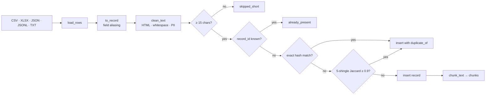

| Step | Behaviour |
|---|---|
| Load | CSV and XLSX via pandas; JSON (list or `{records: []}`); JSONL; TXT (one record per blank-line block). |
| Field aliasing | `FIELD_ALIASES` maps common export columns onto record fields, e.g. `body`/`selftext`/`review` → `text`; `id`/`review_id` → `source_id`; `permalink`/`url` → `source_url`; `created_utc`/`date` → `created_at`; `video_title` → `thread_context`. |
| Clean | Unescape HTML, strip tags, collapse whitespace. |
| PII | Emails → `[email removed]`, phone-like numbers → `[number removed]`, author → salted hash. |
| Dedupe | Exact: SHA-256 of normalised title + text. Near-duplicate: Jaccard similarity of 5-word shingles ≥ 0.9. Duplicates are **kept** with `duplicate_of` set. |
| Idempotency | `record_id = source:source_id`, so re-ingesting a file adds nothing. |
| Chunk | Sentence-boundary splits up to `DE_CHUNK_CHARS`; duplicates get no chunks. |

### Interfaces
- **Consumes:** a file path, a default source, a dataset name, and an optional synthetic flag.
- **Produces:** `ingest_file(store, path, source, dataset, is_synthetic, near_dup_threshold) → {rows, inserted, skipped_short, already_present, exact_duplicates, near_duplicates}`, plus rows in `records` and `chunks`.

### Key decisions

| Decision | Reason |
|---|---|
| Mark duplicates instead of deleting them | Raw evidence is preserved, but duplicates can't inflate counts. |
| Missing fields stay empty | No invented URLs, titles or dates. |
| Scrub PII on ingest | Personal data never reaches analyzers, the database or reports. |

### Verification
Tests: *clean text scrubs PII and chunking works*; *ingest dedupes and is idempotent*.

---

## Phase 2: Analysis Layer

### Goal
Turn each raw chunk into a structured `ChunkAnalysis`: relevance, scenario, memory, forgotten information, search behaviour, failure, workarounds and segment signals.

### Modules

| File | Responsibility |
|---|---|
| `analyze/llm.py` | Claude relevance classifier + evidence extractor; `complete_json` for later synthesis calls |
| `analyze/heuristic.py` | Offline lexicon analyzer with the same output schema |
| `analyze/runner.py` | Picks the analyzer, finds pending chunks, runs them concurrently, handles errors, persists results |

### Design

**Claude analyzer: two calls per chunk**

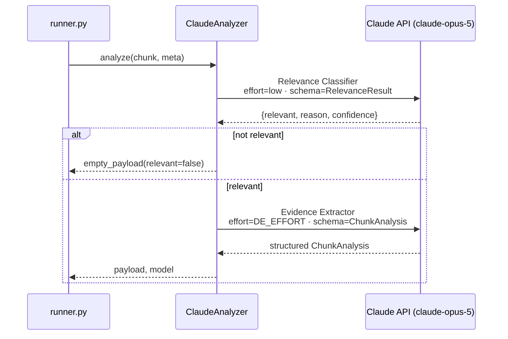

| Aspect | Choice | Reason |
|---|---|---|
| Model | `claude-opus-5` (`DE_MODEL`) | Extraction quality drives every downstream number. |
| Call surface | `client.beta.messages.parse(..., output_format=<Pydantic model>)` | Schema-valid structured output without parsing JSON by hand. |
| Thinking / effort | Adaptive thinking; `low` for relevance, `medium` for extraction | The cheap relevance gate keeps irrelevant posts away from the expensive step. |
| Refusals | `fallbacks: "default"` + beta `server-side-fallback-2026-07-01`; `stop_reason` checked before reading output | A declined chunk is retried server-side rather than silently lost. |
| Caching | System prompt marked `cache_control: ephemeral` | The same instructions are sent for every chunk. |
| Prompt injection | Source text wrapped in `<source>` and declared untrusted | Public text may contain instructions. |
| Evidence rules | Verbatim quotes, keep perspectives separate, no assumed causality, no forced B-stage, no solutions, `proposed:` for new labels | Mirrors the problem statement's guardrails. |

**Mapping to the 12 conceptual AI modules**

| Module | Implemented as |
|---|---|
| 1 Relevance Classifier | Claude call 1 |
| 2–8 Scenario, Memory, Forgotten, Search Behaviour, Failure, Workaround, Segment | Sections of Claude call 2 |
| 11 Evidence Validator | `validate.py` (Phase 3) |
| 9–10 Theme detection, Opportunity synthesis | Deterministic synthesis (Phase 5) |
| 12 Hypothesis Generator | Deterministic templates plus an optional Claude wording pass (Phase 6) |

**Heuristic analyzer**
- **Method:** regex and lexicon matching per sentence. Each quote is the exact sentence that matched, so quotes always validate.
- **Guards:** query and need/goal sentences are excluded from memory extraction; negated statuses ("never found it") are checked before positive ones; confidence is capped at 0.5.
- **Purpose:** offline runs, CI, and a transparent baseline. It is not intended for real-world discovery.

**Runner**

| Behaviour | Detail |
|---|---|
| Selection | `auto` picks Claude when credentials are detected, otherwise the heuristic analyzer |
| Resume | Skips chunks with a current analysis from the same analyzer unless `--reanalyze` |
| Concurrency | Thread pool (`DE_CONCURRENCY`) for Claude; SQLite writes on the main thread |
| Errors | An authentication error stops the run. Refusals, incomplete output and other API errors (after SDK retries) are recorded as skipped and the run continues |

### Interfaces
- **Consumes:** `chunks` joined with record metadata.
- **Produces:** `analyze(chunk_text, meta) → (payload: ChunkAnalysis dict, model)`; `run_analysis(store, analyzer_kind, reanalyze, limit, dataset) → {analyzer, chunks, analyzed, skipped, quotes_total, quotes_invalid, errors}`.

### Key decisions

| Decision | Alternative | Reason |
|---|---|---|
| Two Claude calls per chunk | One summarisation call | Relevance decisions are auditable on their own, and irrelevant text never reaches extraction. |
| LLM extracts per chunk only | LLM writes the insights | Numbers and evidence links can't be hallucinated downstream. |
| Keep a heuristic analyzer | Claude only | Offline runs, CI, and a baseline to compare Claude against. |

### Verification
Tests: *heuristic quotes are all verbatim*; *noise is not relevant*. Offline check: the `ChunkAnalysis` schema compiles for structured outputs.

---

## Phase 3: Evidence Validation

### Goal
Make every AI claim checkable: normalise labels, give each claim an evidence ID, verify each quote against the source, and let a PM correct the result.

### Modules
`validate.py`; overrides in `store.py` (written through the API in Phase 8).

### Design

```
payload ──► normalise labels ──► flatten to signals ──► validate each quote ──► persist
             │                     │                      │
             │ unknown → proposed: │ evidence_id =        │ normalise quote marks/whitespace/case,
             │ "place" →           │ sha1(analysis|kind|i)│ allow "a ... b" elision (in order),
             │ remembered_place    │                      │ min length 3
```

**Signal kinds** (each claim becomes one `signals` row, so counting and drill-down work the same way for every kind):

| `kind` | From `ChunkAnalysis` | Vocabulary | `precision` holds |
|---|---|---|---|
| `remembered` | `remembered_information` | `MEMORY_SIGNALS` | exact / approximate |
| `forgotten` | `forgotten_information` | `FORGOTTEN_INFORMATION` | — |
| `query` | `queries` | query type | `orientation,…\|outcome` |
| `strategy` | `search_strategies` | `BEHAVIORS` | — |
| `refinement` | `query_refinements` | `BEHAVIORS ∪ WORKAROUNDS` | — |
| `behavior` | `user_behaviors` | `BEHAVIORS` | — |
| `workaround` | `workarounds` | `WORKAROUNDS` | — |
| `failure` | `failure_stage` + `failure_quote` | failure taxonomy A–G | — |
| `journey` | `journey` | journey stages | difficulty / ok |
| `segment` | `segment_signals` | usage labels | — |
| `counter` | `counter_evidence` | counter labels | — |
| `expectation` | `expectations` | free | — |

**Validation rules**
- Quotes are checked against exactly the text the analyzer saw (`title + chunk`).
- An invalid quote is **stored** (`quote_valid = 0`) for audit but excluded from every count and view.
- Each analysis row records `quotes_total` and `quotes_invalid`; these appear in the report scope and the dashboard.

**Versioning and overrides**

| Mechanism | Behaviour |
|---|---|
| Re-analysis | A new `analyses` row is added; the previous one is set to `is_current = 0`, so history is kept. |
| Analysis override | Replaces one payload field at read time. Editable: `relevant`, `retrieval_scenario`, `failure_stage`, `success_status`, `perspective`, `describes_retrieval_attempt`, `opportunity_areas`. |
| Signal override | `rejected = true` removes the signal from every view. |
| Audit | Every override stores old value, new value, note and timestamp. |

### Interfaces
- **Consumes:** a raw payload from Phase 2 and its source text.
- **Produces:** `validate_analysis(payload, source_text, analysis_id, record_id) → (payload, signals, {quotes_total, quotes_invalid})`, plus `analyses` and `signals` rows.

### Key decisions

| Decision | Reason |
|---|---|
| Validate deterministically, not with another LLM call | Exact and reproducible, with no extra cost. |
| Unknown labels become `proposed:*` | Observations aren't forced into categories that don't fit. |
| Keep invalid quotes | The audit trail shows what the AI claimed and why it was excluded. |

### Verification
Tests: *quote validation is verbatim but tolerates whitespace*; *unknown labels become proposed*; *fabricated quotes are flagged and excluded*.

---

## Phase 4: Quantitative and Qualitative Synthesis

### Goal
Answer the discovery questions with honest, traceable numbers: what users try to retrieve, what they remember and forget, how they search, where retrieval fails, and what they do instead.

### Modules
`quant.py`

### Design

**Populations** (`Corpus(store, include_synthetic, sources, dataset)`)

| Population | Definition |
|---|---|
| `analyses` | Current analyses of non-duplicate records |
| `relevant` | `relevant = true` after overrides |
| `attempts` | Relevant **and** `describes_retrieval_attempt`; the default denominator for behavioural rates |

**Counting rules**
- Rates count **distinct records**, so a long post cannot inflate a pattern.
- `rate(n, d, definition, scope)` is the only way a percentage is produced. It returns `{numerator, denominator, pct, denominator_definition, scope, directional}`. `directional` is set when `d < DE_MIN_SAMPLE`, shown as †.
- Examples are picked round-robin across sources (`diverse_examples`).
- Scope records sources, date range, synthetic count and analyzer mix.

| Method | Answers |
|---|---|
| `overview()` | Funnel, outcomes, perspectives, quote-validation totals, proposed labels |
| `scenarios()` | What users try to retrieve, with per-scenario outcomes, failure stages, and top remembered, forgotten and workaround labels |
| `memory()` | What is remembered, split exact vs approximate |
| `forgotten()` | What is forgotten; unsuccessful rate with vs without each gap; how often the text itself links the gap to the failure |
| `search_formulation()` | Query types, orientation, outcome by type, length, repeated attempts, strategies |
| `failures()` / `journey()` | Failure-stage distribution; difficulty at each journey stage |
| `workarounds()` | Recovery behaviour |
| `crosstab()` / `scenario_x_forgotten()` | Scenario × failure and scenario × forgotten matrices |

### Interfaces
- **Consumes:** `current_analyses` and `current_signals` (overrides applied).
- **Produces:** the `Corpus` object and JSON-ready distributions used by Phases 5–8.

### Key decisions

| Decision | Reason |
|---|---|
| Count records, not signals | Verbose posts and long threads can't dominate. |
| One rate helper | Denominators can't be invented, and small samples are always flagged. |
| Forgotten information reported as association | The engine doesn't claim causation unless the text states it. |

### Verification
Test: *rate always carries its denominator and directional flag*; end-to-end test checks the populations.

---

## Phase 5: Segments, Opportunities, Contradictions

### Goal
Compare who is affected and which problem spaces have the strongest evidence, without a hidden score, and actively search for evidence against each conclusion.

### Modules
`synthesis.py`, `evidence.py`

### Design

**Shared profile.** `profile()` describes any population (a segment or an opportunity):

| Dimension | Content |
|---|---|
| Volume | records, unique sources, source distribution, max single-source share, first-person attempts |
| Relevance to the business metric | vague-memory cases: records with both remembered *and* forgotten signals |
| Severity | unsuccessful rate, abandonment signals, repeated-search signals |
| Barrier | outcomes, failure stages, dominant stage and its concentration |
| Content | top remembered, forgotten, workaround and segment labels; scenarios |
| Caveat | synthetic share |

**Segments**

| Dimension | Segments |
|---|---|
| Scenario | Document/receipt/health · Screenshot/purchase · Experience memories (travel, food, events, weddings) · People memories (family, friends, school, personal) · Place & object · Video |
| Usage | Large library · Frequent searcher · Screenshot-heavy · Shared library · iOS · Android · Desktop/web |
| Behavioural | Manual browsers · Repeat reformulators (2+ queries) · Abandoners |

Each segment adds: share of attempts; distinctiveness (total-variation distance between its failure-stage mix and all attempts); evidence strength. Research feasibility and intervention potential are explicitly left to PM judgement.

**Opportunities**

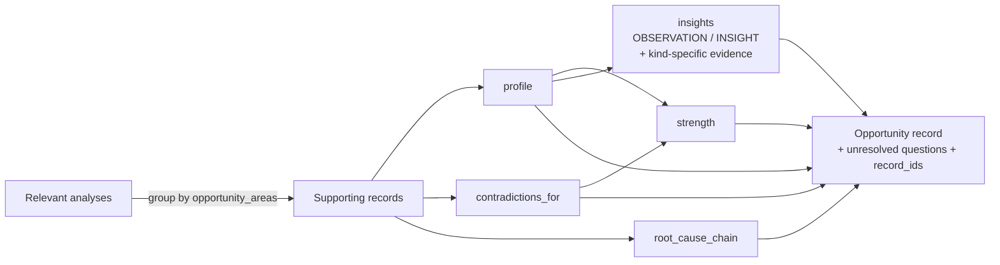

- **Root-cause chain:** symptom (OBSERVATION) → behaviour (OBSERVATION) → barrier (INSIGHT) → potential root cause (HYPOTHESIS), each with evidence.
- **Insights** cite only the signal kinds they are about: failure quotes, failed or abandoned behaviour, remembered and forgotten clues.

**Contradictions**

| Type | Meaning | In strength ratio? |
|---|---|---|
| `explicit_counter_evidence` | Counter signals that refute *this* opportunity per `COUNTER_CONTRADICTS`, weighted by the opportunity's concentration in each counter record's scenario | Yes (weighted) |
| `vague_memory_success` | Incomplete-memory attempts that succeeded without a breakdown; limits how often the barrier occurs | No |
| `alternative_explanation` | Supporting records whose failure is really a data or index limitation | No |
| `source_concentration` | > 50% of supporting records come from one source | No |
| `scenario_concentration` | > 60% of supporting records are in one scenario | No |
| `known_workaround_exists` | Advice posts in the same scenarios | No |

`COUNTER_CONTRADICTS`: `vague_search_succeeded` refutes search-barrier opportunities and `trust_in_search_completeness`; `failure_not_search_related` refutes search-barrier opportunities but **not** `index_coverage_gaps`, which it supports.

**Evidence strength** (`evidence.py`). The first level whose checks all pass is assigned:

| Level | Records | Sources | First-person share | Contradiction ratio |
|---|---|---|---|---|
| HIGH | ≥ 30 | ≥ 4 | ≥ 0.6 | ≤ 0.20 |
| MEDIUM | ≥ 12 | ≥ 3 | ≥ 0.4 | ≤ 0.35 |
| LOW | ≥ 5 | ≥ 2 | — | — |
| DIRECTIONAL | otherwise | | | |

`contradiction ratio = contradicting / (records + contradicting)`. The PASS/FAIL result of each check, the rule table, and a synthetic-share caveat are returned with every level.

### Interfaces
- **Consumes:** `Corpus`.
- **Produces:** `segments(c) → [profile + segment, dimension, share_of_attempts, distinctiveness, evidence_strength, examples]` and `opportunities(c) → [profile + description, severity, strategic_relevance, evidence_strength, contradictions, root_cause_chain, insights, unresolved_questions, record_ids]`, sorted by strength, then records.

### Key decisions

| Decision | Alternative | Reason |
|---|---|---|
| Dimension-by-dimension comparison | Composite score | The spec forbids an arbitrary AI score; the PM sorts by any dimension. |
| Type-specific, weighted contradictions | Counting all counter-evidence everywhere | Counter-evidence can support one opportunity while refuting another; success cases limit severity but don't disprove a barrier. |
| Explicit, printed strength rules | Model-assigned confidence | A PM can challenge every threshold. |

### Verification
End-to-end test: strength levels are valid, record counts match record IDs, and synthetic caveats are present.

---

## Phase 6: Hypotheses and Research Handoff

### Goal
Turn the strongest evidence into testable hypotheses, JTBD candidates, a proposed leading opportunity, an interview brief and the 14-section discovery report, without writing any findings.

### Modules
`hypotheses.py`, `report.py`

### Design

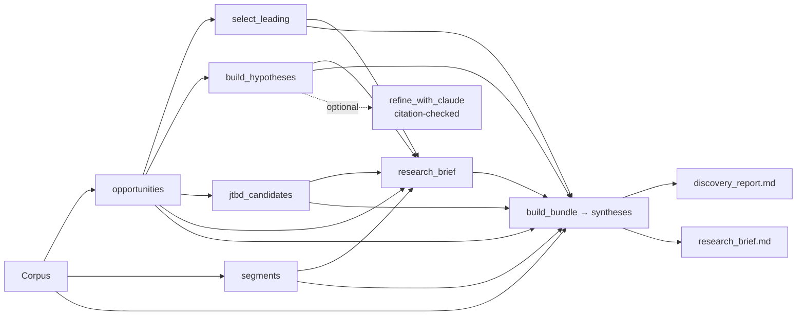

| Output | How it is produced |
|---|---|
| Hypotheses | A per-opportunity scaffold (belief, expected observations, falsification signals) filled with evidence-derived scenarios and clues. BECAUSE lines come only from computed rates. |
| Optional wording pass | `--refine-hypotheses` sends scaffolds and evidence to Claude. Cited evidence IDs are checked against the evidence supplied; invalid ones are dropped and listed. |
| JTBD | WHEN / BUT / HELP ME / SO built from top remembered and forgotten labels, with stated-goal quotes as evidence. Labelled INTERPRETATION. |
| Leading opportunity | Stated rule: keep the best strength tier (MEDIUM or better when any exist), order by vague-memory share, then unsuccessful share, then source count. Returned as a proposal with the full ranking table. |
| Research brief | Target segment (the scenario segment that overlaps most with the leading opportunity), hypotheses, contradictions, unknowns, objectives, screener, questions, behaviours to observe, validation and falsification signals, method notes. The findings section says "Not yet collected". |
| Interview questions | Core behavioural questions plus opportunity-specific ones, passed through `non_leading()`, which rejects "would you use/like", AI, assistant, chatbot, feature and conversational phrasings. |
| Report | `render_report()` writes the 14 sections of the discovery output, with a SYNTHETIC banner whenever synthetic rows are in scope. |

### Interfaces
- **Consumes:** `Corpus`, segments, opportunities.
- **Produces:** `build_bundle(store, include_synthetic, sources, dataset, save) → bundle` (saved to `syntheses`); `write_reports(bundle) → (discovery_report.md, research_brief.md)`.

**Bundle keys:** `generated_at`, `params`, `scope`, `overview`, `scenarios`, `memory`, `forgotten`, `search`, `failures`, `workarounds`, `journey`, `crosstab_scenario_failure`, `crosstab_scenario_forgotten`, `segments`, `opportunities`, `leading`, `hypotheses`, `jtbd`, `research_brief`.

### Key decisions

| Decision | Reason |
|---|---|
| Deterministic templates plus an optional LLM wording pass | Every claim stays tied to computed evidence; the LLM can improve wording but can't add facts. |
| The leading opportunity is a proposal | The decision belongs to the PM. |
| The brief never contains results | Prevents fabricated interview findings. |

### Verification
Tests: *interview questions filter leading phrasing*; end-to-end test checks the report banner and that the brief says "Not yet collected".

---

## Phase 7: Exploration Interface

### Goal
Let the PM search the evidence and ask discovery questions, with answers built only from stored evidence and drawn from diverse sources.

### Modules
`search.py`, `ask.py`

### Design

**Evidence index**

```
query + Filters
   │
   ├─► structured filter pass (sources, scenarios, failure stages, status, perspective,
   │     remembered[all], forgotten[all], workarounds[any], behaviours[any],
   │     opportunities[any], attempts_only, include_synthetic, date range)
   │
   ├─► relevance: TF-IDF (1–2 grams, sublinear) cosine; confidence if no text query
   │
   └─► MMR re-rank: λ·relevance − (1−λ)·max-similarity-to-selected
                    − 0.15·(already selected from same source)
                    − 0.20·(already selected from same thread)
```

**Question interface**

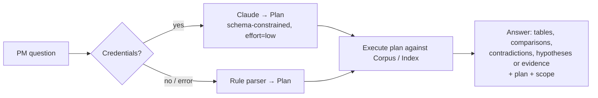

| Plan intent | Executed against |
|---|---|
| `find_evidence` | `EvidenceIndex.search` with remembered/forgotten/status/scenario filters |
| `memory_distribution`, `forgotten_distribution`, `failure_distribution`, `scenario_distribution`, `search_formulation` | `Corpus` methods |
| `workaround_distribution` | Workarounds among failed or unsuccessful attempts |
| `compare_scenarios` | `profile()` per scenario |
| `cross_source_opportunities` | Opportunities with ≥ 3 sources |
| `contradictions`, `hypotheses` | The named opportunity, or the leading one |

### Interfaces
- **Produces:** `EvidenceIndex(store).search(query, Filters, k, lam, source_penalty, thread_penalty) → {total_matches, source_distribution, results[]}`; `answer(store, question, use_claude, k, include_synthetic) → {question, plan, scope, note, evidence | table | comparison | contradictions | hypotheses}`.

### Key decisions

| Decision | Alternative | Reason |
|---|---|---|
| The LLM only produces the plan | LLM-written answers | Every number and quote in an answer comes from stored evidence. |
| TF-IDF + MMR | Embeddings | Deterministic, offline and fast; can be swapped for embeddings without changing filters or MMR. |
| Explicit source and thread penalties | Pure relevance | Stops one platform or thread from dominating results. |

### Verification
Test: *search diversifies sources* and honours the forgotten-label filter. Smoke test: all 11 example questions from the spec return plans and answers.

---

## Phase 8: API and Dashboard

### Goal
Give the PM a local, inspectable interface: overview through drill-down, raw evidence next to AI interpretation, and the ability to challenge the AI.

### Modules
`server.py` (FastAPI) and the discovery workspace: `web/index.html` (shell), `web/styles.css` (design tokens for light and dark themes, components) and `web/app.js` (hash router, views, charts, evidence inspector, ask palette). Vanilla JS, no build step, served from `/static`. The original single-file dashboard remains at `/classic`.

**Added endpoints:** `GET /api/meta` (vocabularies for filters and challenge forms) and `GET /api/review` (low-confidence or unclear analyses, proposed labels, failed quotes, correction log).

**Workspace information architecture:** Understand (Overview, Retrieval journey, Memory gap, Search behaviour, Scenarios) → Decide (Segments, Opportunities + detail) → Hand off (Research plan) → Investigate (Ask & explore, Review queue). A global evidence inspector opens as a side panel from any number, quote or record. It highlights extracted quotes in the raw text by signal kind, and hosts challenge/reject corrections.

### Design

**Endpoints**

| Method | Path | Purpose |
|---|---|---|
| GET | `/` | Dashboard |
| GET | `/api/bundle?include_synthetic=` | Latest discovery bundle (built if missing) |
| POST | `/api/rebuild?include_synthetic=` | Recompute the bundle; clear the index cache |
| GET | `/api/record/{record_id}` | Raw evidence, current AI interpretation, signals, overrides, analysis history |
| POST | `/api/search` | `{query, filters, k}` → diversified evidence |
| POST | `/api/ask` | `{question}` → plan + deterministic answer |
| POST | `/api/override` | PM correction (editable fields listed in Phase 3); anything else returns 400 |
| GET | `/api/report.md`, `/api/brief.md` | Rendered Markdown |

**Dashboard tabs** (addressable by URL hash, e.g. `/#opps`)

| Tab | Content |
|---|---|
| Overview | Funnel tiles, outcome stack, sources, perspectives, analyzer provenance, proposed labels, top failure stages, leading-opportunity proposal |
| Scenarios | Sortable scenario table; scenario × forgotten and scenario × failure heatmaps |
| Remembered / Forgotten | Distributions, exact vs approximate, failure rates with and without each gap, evidence drawers |
| Search formulation | Query types, orientation, strategies, outcome by type, example queries |
| Failures & journey | Stage distribution, journey difficulty, evidence per stage |
| Workarounds | Distribution with evidence |
| Segments | Sortable comparison across all dimensions and strength checks |
| Opportunities | Comparison table; drill-down to insights, patterns, evidence chain, challenging evidence, unresolved questions, strength checks |
| Hypotheses & brief | Leading-opportunity table, hypotheses, JTBD, research brief, Markdown downloads |
| Explore & ask | Question box with the spec's example questions; filterable evidence search |
| Record modal | Raw evidence and AI interpretation side by side; *challenge* a field or *reject* a signal |

**Drill-down path:** Opportunity → Insight → Pattern → Evidence quote → Record modal.

**Visual conventions**
- Colour tokens with separate light and dark themes.
- Single-hue bars for magnitude; fixed-order categorical colours for outcomes, always with a legend and a table.
- Hover tooltips show numerator, denominator and sources.
- A red SYNTHETIC banner whenever synthetic data is in scope.

### Interfaces
- **Consumes:** bundles (Phase 6), the index and answers (Phase 7), records and signals (Phases 1–3).
- **Produces:** overrides (Phase 3) and rebuilt bundles.

### Key decisions

| Decision | Alternative | Reason |
|---|---|---|
| Static HTML dashboard | React/Vite app | No build step, ships with the package, easy for a PM to run locally. |
| A whitelist of editable fields | Free-form editing | PM corrections stay structured and auditable. |

### Verification
API smoke test: every endpoint responds; an invalid override returns 400; rebuild works. Headless screenshots were checked for layout.

---

## Phase 9: Synthetic Generator and Evaluation

> **Status:** superseded for data by Phase 11. The generator and evaluator remain in the codebase for tests. `data/synthetic/` is no longer ingested.

### Goal
Produce a labelled synthetic development dataset with a hidden answer key, to exercise the pipeline and score analyzer accuracy.

### Modules
`synthetic/episodes.py`, `synthetic/generate.py`, `evaluate.py`

### Design

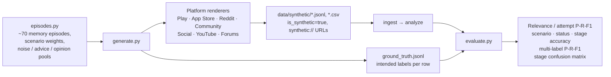

**Row composition per 120 rows**

| Source | Attempt | Success | Misattribution | Opinion | Advice | Noise |
|---|---|---|---|---|---|---|
| google_play | 60 | 10 | 6 | 14 | 0 | 30 |
| app_store | 62 | 10 | 6 | 14 | 0 | 28 |
| reddit | 80 | 8 | 8 | 6 | 10 | 8 |
| google_photos_community | 84 | 4 | 12 | 4 | 10 | 6 |
| social_media | 55 | 14 | 5 | 20 | 6 | 20 |
| youtube | 45 | 12 | 5 | 18 | 25 | 15 |
| forums | 76 | 8 | 8 | 8 | 12 | 8 |

**How an attempt is generated:** sample an episode, a subset of remembered clues, forgotten items, an outcome and a failure stage (from scenario weights); then add queries whose outcomes fit that stage, and workarounds. The generator is seeded, so output is reproducible.

**Outputs:** per-source JSONL files, `synthetic_all.jsonl` / `.csv`, `synthetic_dataset_flat.csv` (for inspection; `truth_*` columns must never be ingested), `ground_truth.jsonl`, README.

### Interfaces
- **Produces:** `write_dataset(out_dir, per_source, seed)`, `write_flat_csv(out_dir)`, `evaluate(store, truth_path) → {binary, exact_match_on_attempts, multi_label_on_attempts, failure_stage_confusion, caveat}`.

### Key decisions
- **Ground truth stays separate:** analyzers never see the answer key.
- **Designed patterns:** the patterns and scores come from the generator's design. They validate the pipeline, not user behaviour or real-world accuracy.

### Verification
Test: *generator counts and labels* (120 × 7, `is_synthetic`, `synthetic://` URLs, README banner).

---

## Phase 10: Tests and Docs

### Goal
Lock in the guardrails with automated tests, and document how to use, extend and trust the engine.

### Modules
`tests/test_engine.py`, `README.md`, `problemstatement.md`, `architecture.md`, `implementationplan.md`

### Design: test coverage by phase

| Phase | Area | Test |
|---|---|---|
| 1 | Ingestion | PII scrub, chunking, exact dedupe, idempotent re-ingest |
| 2 | Analysis | Heuristic quotes are verbatim; off-topic noise is not relevant |
| 3 | No fabrication | Invented quotes flagged and excluded; unknown labels become `proposed:*` |
| 3 / 8 | Human in the loop | Overrides apply on read; the stored AI payload is unchanged |
| 4 | Honest numbers | Rates carry denominators; zero denominator gives `pct = None`; directional flag |
| 5–6 | End to end | Ingest → analyze → bundle; valid strength levels; counts match; synthetic caveats and banners; brief has no findings; excluding synthetic data gives an empty corpus |
| 6 | Solution neutrality | Leading interview questions are filtered out |
| 7 | Retrieval diversity | Results span sources; forgotten-label filters are honoured |
| 9 | Synthetic dataset | 840 rows, 120 per source, `is_synthetic`, `synthetic://` URLs |

Tests build temporary databases from generated data, so they never touch `data/discovery.db` or the raw dataset.

### Verification
`python -m pytest -q tests` → 13 passed.

---

## Phase 11: Raw Dataset `google_photos_discovery_annotated`

### Goal
Make `google_photos_discovery_annotated.xlsx` the engine's single source of data, ignore all earlier datasets, and rebuild every output from it, while keeping the dataset's own annotations independent of the analyzers.

### Modules
No pipeline code changes. This phase uses Phase 1 ingestion as-is, plus two files at the project root: `google_photos_discovery_annotated.xlsx` and `google_photos_discovery_annotated.csv`.

### Design

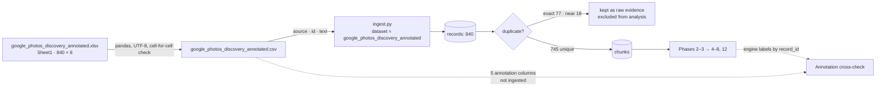

**Dataset profile**

| Property | Value |
|---|---|
| Rows × columns | 840 × 8 |
| Columns | `source`, `id`, `text`, `retrieval_intent`, `retrieval_scenario`, `retrieval_object`, `memory_clues`, `forgotten_information` |
| Rows per source | 120 each: google_play, app_store, reddit, google_photos_community, social_media, youtube, forums |
| IDs | Unique; prefixes `gplay`, `app`, `red`, `goo`, `soc`, `you`, `for` |
| Text length | 48–886 characters (median 323) |
| Missing values | None |
| Dates | No date column |
| Duplicate texts within the file | 72 |

**Column handling on ingest**

| Dataset column | Handling | Notes |
|---|---|---|
| `source` | → `source`, and `platform` (defaults to source) | 7 source types |
| `id` | → `source_id`; `record_id = source:id` | Stable evidence key; also the join key for annotations |
| `text` | → `text` → cleaned → chunked | Most rows are one chunk |
| `retrieval_intent`, `retrieval_scenario`, `retrieval_object`, `memory_clues`, `forgotten_information` | **Not ingested** (no field alias). Kept in the CSV and joined by `record_id` for cross-checks | Keeps the annotations independent of analyzer output |
| — | `title`, `created_at`, `source_url`, `thread_context`, `replies`, `engagement`, `author_hash` left empty | Not in the file; nothing is invented |

**Annotation cross-check**

The annotations and the engine's labels are joined on `record_id` for the 745 unique records.

| | Engine: relevant | Engine: not relevant |
|---|---|---|
| **Annotation: retrieval-related** | 567 | 10 |
| **Annotation: not retrieval-related** | 10 | 158 |

Relevance agreement is **725 / 745 (97.3%)**. The other annotation columns use broader categories than the engine's taxonomy (e.g. `person/relationship` ↔ `remembered_person` + `remembered_relationship`), so comparing them needs a reviewed label mapping first. See [evals.md](evals.md) §3.

**Provenance.** The dataset is ingested with no provenance flag, so outputs name the dataset and make no claim either way. `DE_PROVENANCE` / `--provenance` controls presentation (`auto` discloses flagged records with banners, caveats and per-record tags; `neutral` names the dataset only); with nothing flagged, both modes read the same. The audit record of the pre-ingest check lives in problem statement §22.5.

**Effects of the missing fields on earlier phases**

| Phase | Effect |
|---|---|
| 1 Ingestion | Without titles, short posts collide more often: 95 of 840 rows are marked duplicate (77 of those copy text from another source). |
| 3 Validation | Quotes are validated against `text` only. |
| 4 Quant | Scope has no date range; date filters have no effect. |
| 5 Segments | Usage segments rely only on signals found in the text. |
| 7 Search | The thread-diversity penalty never fires; the source-diversity penalty still applies. |
| 8 / 12 Workspace | Evidence shows `record_id` and source; date and source link are blank. |
| 9 Evaluation | `evaluate` needs a mapped answer key; the annotations can supply one after mapping. |

**Current run** (heuristic analyzer; will change with a Claude run or PM corrections)

| Metric | Value |
|---|---|
| Records in database | 840 (dataset `google_photos_discovery_annotated` only) |
| Duplicates marked | 95 (77 exact, 18 near) |
| Unique records analysed | 745 |
| Relevant to retrieval | 577 / 745 |
| First-person retrieval attempts | 552 |
| Quotes extracted / failed verbatim check | 11,119 / 0 |
| Opportunity strength | `index_coverage_gaps` HIGH; the other seven MEDIUM |
| Proposed lead / runner-up | `approximate_time_anchoring` / `candidate_recognition` |

### Interfaces

```bash
# delete data/discovery.db first for a clean rebuild (stop the server first; it holds the file open)
python -m discovery_engine ingest google_photos_discovery_annotated.csv --dataset google_photos_discovery_annotated
python -m discovery_engine analyze
python -m discovery_engine synthesize
python -m discovery_engine serve --port 8931
```

### Key decisions

| Decision | Reason |
|---|---|
| Ingest only `source`, `id`, `text` | Annotations stay an independent check on the engine instead of leaking into its labels. |
| Convert to CSV and verify cell by cell | Plain text is easy to diff and inspect; the check guarantees nothing changed in conversion. |
| Reset the database | Guarantees no earlier dataset leaks into counts. |
| Ingest without a provenance flag | The dataset is presented neutrally: outputs name it and claim nothing about its origin. The pre-ingest check is recorded in problem statement §22.5. |
| No ingest code changes | Existing field aliases already map `id` → `source_id`. |

### Verification
- CSV identical to the xlsx in all 840 × 8 cells.
- Database contains one dataset (`google_photos_discovery_annotated`), 840 records.
- 0 invalid quotes; reports and brief regenerated; 15 tests pass.
- Workspace serves the new bundle (`/api/bundle`, `/api/review` return 200).

---

## Phase 12: Discovery Workspace (UI/UX)

### Goal
Replace the single-page dashboard with a workspace that follows the discovery chain. A PM should be able to go from any number to the quotes behind it, question the AI in place, and leave with a research plan.

### Modules

| File | Responsibility |
|---|---|
| `web/index.html` | App shell: sidebar, top bar, drawer, ask palette, tooltip and toast containers |
| `web/styles.css` | Design tokens (light and dark), layout, components, charts, responsive rules |
| `web/app.js` | Hash router, views, chart components, evidence inspector, corrections, ask palette, search |
| `server.py` | Static file mount; new `GET /api/meta` and `GET /api/review`; `/classic` keeps the old dashboard |

### Design

**Information architecture**

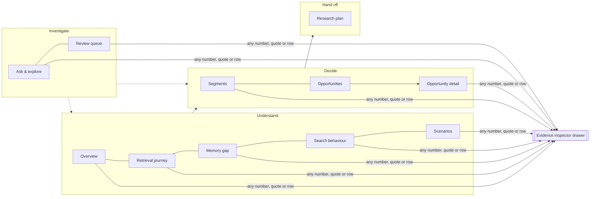

| View | Answers | Main components |
|---|---|---|
| Overview | What the evidence says at a glance | KPI tiles, evidence funnel, proposed lead with margin to runner-up, six discovery-question cards, journey strip, outcome and source bars |
| Retrieval journey | Where attempts break down, and what people do next | 5 stage cards (Recall, Express, Match, Recognize, Recover), breakdown bars with definitions, workaround bars, scenario × breakdown heatmap |
| Memory gap | What's remembered vs forgotten, and whether gaps go with failure | Paired bar lists, dumbbell chart (unsuccessful with vs without each gap), exact/approximate bars, scenario × forgotten heatmap |
| Search behaviour | How people search with incomplete memory | Query type and orientation bars, outcome-by-query-type bars, strategies, verbatim queries |
| Scenarios | What people try to retrieve | Sortable table with outcome bars, two heatmaps |
| Segments | How people retrieve, and who to take into research | Two behavioural segments (Direct, Contextual; Phase 14): partition bar, segment cards, side-by-side table, impact mapping, retrieval-states table, secondary-lens heat tables, placement rules, segment profile drawer with **Select** |
| Opportunities | Where the metric is lost, and which problem spaces sit there | Metric decomposition table (Phase 13), numbered opportunity map with ranked legend, sortable comparison table |
| Opportunity detail | Why this opportunity, and what challenges it | Evidence chain, insights with epistemic tags, strength checks, contradictions, unknowns, scenario and source bars |
| Research plan | What to test, how it will be run, and the problem it defines | Three tabs: Plan and hypotheses (screener, hypothesis cards, JTBD, interview guide, checklists), Method (Phase 13), Problem definition (Phase 13) |
| Ask & explore | Ad-hoc questions and evidence search | Question box with suggestions, answers showing how the question was read, faceted search |
| Review queue | Where the AI needs a human | Needs review, proposed labels, quote failures, correction log |

**Interaction patterns**

| Pattern | Behaviour |
|---|---|
| Drill-down | Every bar, heatmap cell, journey stage, table row and map bubble opens the matching records (`/api/search` with filters), spread across sources |
| Evidence inspector | Raw text with extracted quotes highlighted by signal kind; AI interpretation beside it; stacked navigation with Back |
| Challenge / reject | Inline forms post to `/api/override` with a required reason; a toast offers Rebuild; the original AI output is kept |
| Ask palette | Ctrl+K or `/` opens it: ask a question, pick a suggestion, or jump to a view or opportunity |
| Honest numbers | Every rate shows its percentage and numerator/denominator; hover shows the denominator definition; † marks small samples |
| Close-call flag | The overview flags the lead when the runner-up is within a few points |
| Provenance display | Top-bar pill naming the dataset. If records are flagged at ingest and the mode is `auto`, it instead shows a disclosure pill, a notice on views and per-record tags. Nothing is flagged in this project, so the display stays neutral |
| Readable labels | Backend labels and dict strings in narrative text are rewritten for display (`prettyText`); numbers and wording are untouched |

**Design system**

| Element | Choice |
|---|---|
| Colour | Tokens for light and dark; dataviz reference palette in fixed categorical order for outcomes and signal kinds; single-hue sequential ramp for magnitude, heatmaps and strength; text never wears series colour |
| Evidence strength | 4-step meter plus the level name; tooltip lists each PASS/FAIL rule |
| Epistemic tags | OBSERVATION · INSIGHT · INTERPRETATION · HYPOTHESIS, visually distinct |
| Typography | Inter with system fallback; tabular numerals for data |
| Layout | Sticky sidebar and top bar; card grid; drawer 640 px; collapses to a single column with an off-canvas menu below 960 px |
| Accessibility | Skip link, focus rings, keyboard access (Esc, Enter, Ctrl+K, `/`), ARIA labels, reduced-motion support, colour never the only cue (legends and labels always shown) |

### Interfaces
- **Consumes:** `GET /api/bundle`, `/api/meta`, `/api/review`, `/api/record/{id}`; `POST /api/search`, `/api/ask`, `/api/override`, `/api/rebuild`; Markdown at `/api/report.md`, `/api/brief.md`.
- **Produces:** PM overrides; rebuilt bundles.

### Key decisions

| Decision | Alternative | Reason |
|---|---|---|
| Vanilla JS, no build step | React/Vite | Ships with the Python package; nothing to install for a PM |
| UI shows backend numbers only | Recompute in the browser | One source of truth; the only UI arithmetic is labelled sums and differences (e.g. unsuccessful = sum of outcomes, margin to runner-up) |
| Numbered map with ranked legend | Direct bubble labels | Opportunities cluster (most at 78–89% unsuccessful), so direct labels collided |
| Keep `/classic` | Remove old dashboard | A fallback while the workspace beds in |

### Verification
- **Browser tests** (`tools/ui_check.py`, Playwright, Edge): 55 checks passed with no console or page errors.
  - All 11 views render in light and dark mode.
  - Drill-down, inspector, challenge form, back and escape, palette ask, suggested questions, facet search, sorting, segment and stage drawers, map navigation, review tabs.
  - No horizontal overflow at 390 px; mobile menu opens.
- **Bugs found through screenshots and fixed:**
  - Bar fills didn't render (inline spans).
  - Hidden challenge forms showed as empty boxes.
  - Duplicate checkbox markers in strength checks.
  - Raw labels in narrative text.
  - Colliding map labels.
  - A focus-outline artefact.
- **Backend bug found through the UI:** the research brief had no hypotheses, because they were only built for the top four opportunities by strength, which excluded the lead and runner-up. Fixed in `report.py`, with a regression test.

---

## Phase 13: Metric Decomposition, Methodology and Problem Definition

### Goal
Carry the engine's evidence the last three steps of the PM case study: break the business metric into the product outcomes that make it up (Part 2), state how the 5-6 interviews will actually be run and why that method (Part 3), and assemble a problem definition that survives the "so what" test (Part 4). All three are built from the same evidence as everything else, and none of them names a feature.

### Modules

| File | Responsibility |
|---|---|
| `decomposition.py` | Maps failure codes to journey stages, measures where the metric is lost, computes per-stage headroom, ranks stages by recoverable share |
| `problem.py` | `METHODOLOGY` (the research design, what each part of the session buys, alternatives, ethics and validity threats) and `build_problem_definition()` (the nine-field definition plus the evolution chain) |
| `research.py` | Research fit per segment: measured content sensitivity and segment overlap, rule-derived recruitability and observability, a segment-specific screener, and how the session changes |
| `report.py` | Puts the decomposition in the bundle and report §2, the problem definition in §15, and the methodology into the brief |
| `store.py` | `selected_target_segment()` reads the PM's chosen segment from the override log |
| `server.py` | `study.target_segment` is an editable override target |
| `web/app.js` | `decompositionCard()` on Opportunities; selection criteria, target banner and **Select** on Segments; Plan / Method / Problem definition tabs on Research plan |

### Design

**Part 2 - where the metric is lost**

```
successful retrieval of a vaguely remembered photo
  = attempts that get through five stages:
      1 RECALL     the user remembers enough contextual information to identify the intended photo
      2 EXPRESS    the user converts what they remember into a search attempt
      3 MATCH      Photos surfaces candidates that correspond to the remembered clues
      4 RECOGNIZE  the user can identify the intended photo among the candidates
      5 RECOVER    after a failed attempt, the user can refine or change the search and continue
  + the item being retrievable at all (data and index, outside the user's journey)
```

Each stage is a **user capability**, not a system component, so every stage can be stated as a product outcome and sized from the evidence. The same five names are the `journey` signal vocabulary in `taxonomy.py`, so the journey page, the decomposition and the interview coding scheme all speak one language.

`MATCH` merges two failure codes (`B_system_understanding`, `C_retrieval`) because public text rarely separates "search read my words differently" from "the photo never came back". The merge is a reporting choice, not a loss of evidence: `STAGE_COMPONENTS` keeps both counts visible on the row, and a mission check fails if they stop summing to the merged total.

For each stage the engine reports, from first-person retrieval attempts only:

| Figure | Definition |
|---|---|
| Breaks here | attempts whose extracted breakdown sits at this stage / all attempts |
| Still unresolved | of those, the ones that did not end in a confirmed find |
| Max headroom | unresolved-here / all attempts, in percentage points |
| Product outcome | what becomes true for users if the stage stops failing - never a feature |
| Opportunity areas | the opportunity areas whose records break down at this stage |

Measured on the current corpus: 32.6% of attempts (180/552) end in a confirmed find (29.7% before the Phase 14 analyzer fix; see there). The largest single recoverable share sits at **Match** (+13.4 points), just ahead of data and index (+13.2), then Express and Recognize (+12.9 each) and Recover (+6.3). Recall shows 0: the metric's population is defined as people who do remember something, so every attempt passes that stage by definition, and the row is kept visible rather than hidden.

Headroom is an upper bound and is labelled `INTERPRETATION` everywhere it appears: it assumes each attempt has one decisive breakdown and that nothing else changes. Stages with no measured breakdowns are shown as zero rather than hidden, and the attempts that describe no breakdown (20.5%) are stated beside the table so the shares reconcile against the denominator.

**Target segment (the PM's choice, not the engine's)**

The Segments page states the criteria to compare on (frequency, severity, clarity of the unmet need, distinctiveness, evidence strength, relevance to the metric) and says plainly that size alone is not a reason to pick one. **Select** writes an override (`study` / `target_segment`); the research plan and problem definition read it on the next rebuild and mark it "Chosen by you". With nothing chosen, the brief falls back to the recruitment mix that covers the tested opportunities (120/156 records, 76.9%), so the handoff is never blocked on a decision.

**Part 3 - methodology**

A **hybrid retrieval-episode study on the participant's own library**, in four parts, each chosen for what it buys:

| Part | What happens | What it buys |
|---|---|---|
| Memory elicitation | A spoken memory card per target - time, people, place, objects, text, appearance, occasion, and confidence in each - with the device face down | The held memory, independent of the query. The difference between this and what they later type is the express-stage gap, which no public post can show |
| Seeded unaided live attempt | They attempt a photo they nominated at recruitment, thinking aloud, with no help. Success is their own recognition | Observed express, match, recognize and recover behaviour, in their real library at real scale |
| Retrospective walkthrough | One past episode reconstructed step by step | Episodes that cannot be reproduced to order, above all the abandoned ones |
| Assisted resolution, last | The moderator helps find the item and records whether it existed and was indexed | Ground truth per episode: user-stage failure or data/index limitation. Last, so nothing teaches the participant mid-session |

Two design decisions carry the weight. First, **the memory is captured before the device is in hand** - the problem is a gap between held memory and expressed query, and that gap is not measurable if the query comes first. Second, **every episode ends in a known resolution** - 22.3% of corpus attempts break at data and index, and no interview can separate "could not find it" from "it was never there" without finding the item together at the end.

The earlier plan, a retrospective walkthrough alone, is now recorded as a **rejected alternative**: it repeats the evidence type the corpus already holds, and asks people to recall a memory failure from memory. It survives as one part of the session, not as the whole of it. Also rejected: a lab task on a researcher-supplied library (the participant's memory of their own photos is the thing under study and cannot be transplanted), survey, diary study, concept usability test and log analysis.

Episodes are coded with the engine's own taxonomy, so interview results and corpus evidence can be compared instead of merely narrated. The primary analysis is the **clue delta**: held vs expressed vs what the system needed.

**Research fit per segment**

Choosing who to interview is not only about who hurts most; it also decides what the session can be. `research.py` gives every segment:

| Field | How it is produced |
|---|---|
| Content sensitivity | Measured: share of the segment's attempts about health images, documents, receipts, purchase references or work material. Above 40%, the session runs with no screen share. Flagged as *definitional* when the segment is defined by that content |
| Segment overlap | Measured: the share of this segment's records that also sit in another segment (containment, not Jaccard - the question is how much of *this* segment you also get). Stops a PM agonising between two segments that are 80% the same people |
| Recruitability | Rule from the segment's dimension: behavioural segments screen on the behaviour, scenario segments on a recent episode of that content, usage segments on a factual question *plus* the incident question, because library size alone does not mean the person has the problem |
| Observability | Rule: behavioural segments are observable live; scenario segments partly; Abandoners are recall-only, because the behaviour is the act of stopping and cannot be re-run to order |
| Screener | Generated for the segment: incident qualifier first, then the segment's own must-be-yes, then capture questions, an insider exclusion, and a consent question wherever content is sensitive |
| Session shape | What changes for this segment - where the time goes, and whether a screen share is allowed at all |

The chosen segment's screener and session changes flow into the research brief and the Method tab. With no segment chosen, the brief keeps the generic screener and the Method tab says plainly that the plan is not yet adapted.

**Part 4 - problem definition**

Nine fields, each carrying its epistemic level, its evidence, and where relevant the question that would settle it in interviews: target user segment, retrieval scenario, product outcome to influence, root cause (`HYPOTHESIS`), existing workarounds, why it creates user value, why it makes business sense (with the questions public posts cannot answer), what this problem is *not*, and the competing explanation to rule out. Above them sits the five-step chain the thinking travelled: business metric -> product outcomes -> AI-powered discovery -> observed user behaviour -> problem definition.

The "what this problem is not" field exists because the obvious framing - "users find it difficult to search for old photos" - is the one the case study rules out. The engine states the narrower claim the evidence supports: users arrive holding real clues (time approximation, person, visual appearance) and still fail, because what the retrieval path needs (exact date, exact location, exact object name) is what they no longer have.

### Interfaces
- **Consumes:** the analysis corpus, the opportunity set, the leading-opportunity proposal, and the PM's segment override.
- **Produces:** `bundle.decomposition`, `bundle.target_segment`, `bundle.problem_definition`, `research_brief.methodology`; report §2 and §15; the methodology section of the brief.

### Key decisions

| Decision | Alternative | Reason |
|---|---|---|
| Headroom as an upper bound per stage | A modelled uplift forecast | The corpus cannot support a forecast; an upper bound is enough to rank stages and is honest about its assumption |
| Data and index shown as a row, marked outside the journey | Folding it into Match | It is the largest single share of breakdowns (22.3%) and it is not a user behaviour; merging it would hide that |
| Five stages, each a user capability | The earlier seven-step model (remember, express, understand, retrieve, evaluate, refine, confirm) | Confirm carried no measured breakdowns, and understand and retrieve could not be told apart reliably in public text. Five stages state what has to go right, which is what Part 2 asks for |
| Problem definition assembled by the engine, marked DRAFT | Leaving Part 4 to the PM | The evidence for each field already exists; drafting it makes the gaps visible, and every field carries the question that settles it |
| Segment choice is a PM override, not a score | Ranking segments automatically | The comparison dimensions conflict; the engine surfaces them and records who chose |
| The method adapts to the segment | One session script for everyone | Privacy, recruitability and what can be observed differ by segment. A health-record retriever cannot be asked to share a screen; an Abandoner cannot be asked to re-run giving up |
| Memory elicited before the device is touched | Ask what they remembered after the attempt | Asking after the search contaminates the answer with what the search returned. The gap between held and expressed memory is the whole measurement |

### Verification
- `tools/mission_check.py`: 69/69, including 34 checks specific to Parts 2-4 and a guardrail extension that scans stage outcomes and every problem-definition field for solution language. Stage shares reconcile against the denominator (439 + 113 + 0 = 552), headroom is labelled an upper bound, every problem-definition field carries a level, the root cause is a `HYPOTHESIS` with a settling question, the banned framing appears only in "what this problem is not", and the evolution chain runs metric -> problem.
- `tools/ui_check.py`: 60/60 in light and dark, no console or page errors, including stage rows drilling into the attempts behind them, the research-fit column and drawer section, and the three research tabs.
- **Fixed during this phase:** a TDZ `ReferenceError` on the Segments view, the row click handler swallowing the Select button, a doubled "Draft. DRAFT" banner, the Select column clipped out of the segment table (mini-bars narrowed to 52 px), and a retrieval scenario that failed to say what the user still remembers.

---

## Phase 14: Behavioural Segmentation

### Goal
Replace the earlier segments (six scenario groups, seven usage groups and three behaviour groups that overlapped freely) with one primary segmentation by **what the user did when retrieving**, plus three secondary lenses that cut across it. A PM should be able to size each segment against the business metric, see what else its attempts show, and take one into research.

### Revision (NextLeap binary model)

The design below was revised from an earlier four-way precedence model (Direct, Contextual, Candidate-Heavy, Recovery as four *primary* segments, chosen by precedence when an attempt showed more than one behaviour). The primary cut is now **binary and exhaustive** - Direct vs Contextual, with Contextual as the complement of Direct by construction, matching the NextLeap framing that Person/Event/Location/Visual/Text are memory clues, not segments, and that Candidate-heavy/Recovery-dependent are *states an attempt can be in*, not segments a user belongs to. Those two behaviours moved into a new **Retrieval State** secondary lens (`direct_low_effort`, `candidate_heavy`, `recovery_dependent`, `unresolved`, `unavailable`), alongside Memory State and a re-derived Retrieval Complexity. The old precedence rule, the "unclassified remainder" concept, and the `also_shows`/`membership` cross-tabs were removed, since a binary exhaustive split has no remainder and no meaningful "also shows the other primary segment" (an attempt can't be both). See [[segmentation_framework_nextleap]] in project memory for the full spec this was built from.

### Modules

| File | Responsibility |
|---|---|
| `behavior_segments.py` | Behaviour flags per attempt; binary primary placement (`direct` if the Direct rule is met in full, else `contextual`); the three secondary lenses (memory state, retrieval complexity, retrieval state); `IMPACT_MAP` and `TARGET_SEGMENT_HYPOTHESIS` |
| `synthesis.py` | `segments()` returns the two segment profiles and a `segment_overview` (partition, rules, impact map, target-segment hypothesis, lenses); `retrieval_state_profiles()` returns the five retrieval-state profiles |
| `research.py` | `research_fit()` for the two primary segments; `research_fit_by_state()` one level deeper, for the five retrieval states (role, recruiting, observability, sensitivity, screener, session shape) |
| `report.py` | Report §10 rewritten: binary segments, impact mapping (WHY/WHO/HOW/WHAT), target-segment hypothesis, a Retrieval States table, then the three secondary lenses |
| `search.py` | `record_ids` filter, so any segment, retrieval state or lens cell drills into exactly its attempts |
| `analyze/heuristic.py` | Recognises success stated from the system's side ("it found the photo in seconds"); "never found it" no longer counts as a found query outcome |
| `web/app.js`, `web/styles.css` | Segments page: two segment cards, impact-mapping card, retrieval-states card, lens tabs, segment drawer |

### Design

**Primary: binary, exhaustive**

| # | Segment | Definition | Placed here when |
|---|---|---|---|
| 1 | Direct Retrieval | Strong identifier, found with little effort | Found, one attempt, no breakdown, no change of route, no lost identifier, and a precise person/place/text/object or a search by keyword, face, date, place or album. A descriptive sentence that worked is Contextual, not Direct |
| 2 | Contextual Retrieval | Everything that is not Direct | Circumstantial clues, a lost identifier alongside something remembered, or the scene described in a sentence - the complement of Direct by construction, so the two always sum to 100% |

Current partition of the 552 attempts (single-source dataset, synthetic excluded): Direct 26 (4.7%), Contextual 526 (95.3%).

**Retrieval state** (secondary lens, not a primary segment) describes how an attempt actually played out, by precedence: a data/index limitation is Unavailable; otherwise a crowded or hard-to-distinguish result set is Candidate-heavy; otherwise a changed route after a failed first attempt is Recovery-dependent; a clean find is Direct/low-effort; anything else is Unresolved. Current distribution: Direct/low-effort 104 (18.8%), Candidate-heavy 82 (14.9%), Recovery-dependent 285 (51.6%), Unresolved 40 (7.2%), Unavailable 41 (7.4%). This is the same evidence the old precedence-based primary segments used for Candidate-heavy and Recovery - what changed is that it now characterizes attempts *within* Direct/Contextual rather than competing with them for primary placement.

**Secondary: three lenses across the two segments**

| Lens | Question | Categories | Rule |
|---|---|---|---|
| Memory state | What does the person still hold? | Identifier held · Partial identifier · Context only · Nothing specific | Remembered and forgotten signals, plus what the person typed (a query describing who, where, when or what it looked like is memory they held) |
| Retrieval complexity | How many clues, and how ambiguous? | Low · Medium · High · None stated | Distinct kinds of clue (remembered or typed) combined with whether any is a precise anchor: low = 1-2 kinds with an anchor, high = 3+ kinds with none, medium = everything else |
| Retrieval state | How did the attempt play out? | Direct/low-effort · Candidate-heavy · Recovery-dependent · Unresolved · Unavailable | See above |

**Impact mapping.** Report §10 and the Segments page both carry the WHY -> WHO -> HOW -> WHAT chain: WHY is the business outcome, WHO is Contextual Retrieval users (especially in a candidate-heavy or recovery-dependent state), HOW is "connect multiple contextual memories into a successful retrieval path without repeated search failure or manual candidate inspection," and WHAT is explicitly left open - a list of directions to evaluate later, none chosen, pending primary research. The standing target-segment hypothesis is stated alongside it: "Contextual Retrieval users whose incomplete memories lead to candidate-heavy or recovery-dependent retrieval."

**Page layout**

Partition bar across all attempts (2 segments) · two segment cards (share, found, gave up, evidence strength, journey stages, role in the study, Select) · side-by-side sortable table · impact-mapping card · retrieval-states card (bar + table + primary-segment mix) · secondary lens tabs as segment × category heat tables with find rates beside them · placement rules. Every share, cell and card drills into exactly its attempts.

Colour follows the dataviz method: the two segments take categorical slots 1-2 in fixed order; retrieval states take their own five-colour set; the lenses are ordered, so they are drawn as heat tables on the single-hue sequential ramp, with identity carried by column labels.

### Key decisions

| Decision | Alternative | Reason |
|---|---|---|
| Binary, exhaustive primary segmentation | Four-way precedence (Direct/Contextual/Candidate-heavy/Recovery) | NextLeap framing treats Candidate-heavy and Recovery as states an attempt is in, not segments a user belongs to; a binary split also removes the need for a precedence rule and an "unclassified" remainder |
| Candidate-heavy and Recovery-dependent as Retrieval State categories | Keep as primary segments | Preserves the same underlying evidence and definitions, but stops them competing with Direct/Contextual for primary placement |
| Retrieval complexity uses clue count *and* precision | Clue count alone | Reproduces the intuition that "Rahul, Goa" (2 precise clues) is lower complexity than "that café, blue chairs, sometime" (3+ clues, none precise), which count alone does not distinguish |
| Lenses as heat tables | Stacked bars in a second palette | Ordered categories want a sequential ramp; a second categorical palette on the same page would collide with the segment colours |
| Lens find rates exclude unstated outcomes | All attempts as denominator | Posts about deleted photos state no outcome; counting them as failures blames the memory state for missing data |
| Stale target choice set aside | Keep the stored name | An earlier choice may no longer name a segment; carrying it into the plan would describe people who do not exist in the data |

### Verification
- `tools/mission_check.py` **84/91** on the current single-source dataset. The 7 failures are one known, pre-existing DB state issue (a superseded synthetic dataset that a safety guardrail blocked from being deleted, so the DB briefly holds two datasets instead of one - the server and CLI now default to excluding it) and a reference-label comparison feature (`Store.reference_labels`, a `reference_comparison` bundle key, a "§ Engine vs the dataset's own labels" report section) that was referenced by the check script but was never actually built - both pre-date this segmentation revision.
- `tools/ui_check.py` requires `playwright`, which is not installed and not in `requirements.txt`; not run.
- Segmentation-specific checks (binary partition sums to all attempts; retrieval states sum to all attempts; every Recovery-dependent attempt's first try genuinely failed, recomputed independently from stored analyses; every secondary lens places every attempt exactly once, overall and within each segment; lens find rates exclude unstated outcomes; impact map and target-segment hypothesis are present) all pass.

---

## CLI Reference

```
python -m discovery_engine [--db PATH] <command>

# Current pipeline (Phase 11, google_photos_discovery_annotated only)
ingest PATH... [--source NAME] [--dataset NAME] [--synthetic]     # Phase 1
#   e.g. ingest google_photos_discovery_annotated.csv --dataset google_photos_discovery_annotated --synthetic
analyze [--analyzer auto|claude|heuristic] [--reanalyze] [--limit N] [--dataset NAME]   # Phases 2–3
synthesize [--exclude-synthetic] [--sources ...] [--refine-hypotheses]                 # Phases 4–6
ask "question"                                                    # Phase 7
serve [--port 8931]                                               # Phases 8, 12

# Legacy (Phase 9)
generate-synthetic [--out DIR] [--per-source 120] [--seed 7]
evaluate [--truth PATH]
demo [--per-source 120]        # regenerates the old synthetic dataset; do not use with the raw dataset
```

---

## Known Limitations and Next Steps

| Limitation | Phase | Next step |
|---|---|---|
| The raw dataset has only `source`, `id`, `text` plus annotations (no dates, titles, URLs, threads or engagement) | 11 | Add those fields at source when available; the ingestion aliases already accept them. |
| Annotations use broader categories than the engine | 9, 11 | Agree a label mapping, convert annotations to the `ground_truth.jsonl` format, run `evaluate`. |
| Browser tests need a running server and Edge, so they live in `tools/` rather than pytest | 12, 13 | Wire `tools/ui_check.py` into CI behind a fixture that starts the server. |
| The Claude analyzer hasn't made a live API call in this build | 2 | Run on a small sample, spot-check against the heuristic, then tune `DE_EFFORT`. |
| Heuristic accuracy is inflated on template text | 2, 9 | Use Claude for real data and build a hand-labelled evaluation set. |
| No live collectors (Reddit, app stores, YouTube APIs) | 1 | Add adapters that write the ingestion format, respecting each platform's terms. |
| Theme detection is taxonomy-driven | 5 | Cluster `proposed:*` labels and free-text values to surface emerging themes for the PM to promote. |
| Opportunity mapping comes only from the analyzer | 5 | Let the PM define opportunity rules over signals. |
| Frequency per user can't be measured from public posts | 6 | Carried into interviews as an unresolved question (already emitted). |
| Batch cost on large corpora | 2 | Move extraction to the Message Batches API. |
